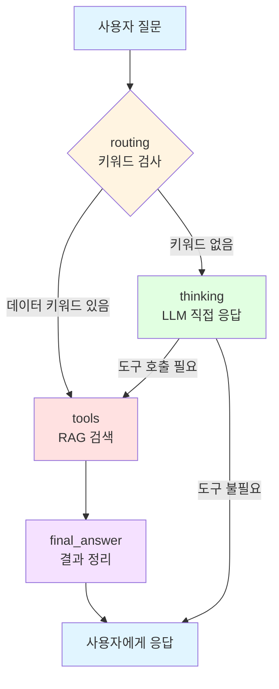

# 🤖 agent_with_garph.py 코드 완전 분석

> **Dataset Explorer Agent**의 핵심 로직 - LangGraph 기반 지능형 라우팅 시스템

---

## 📋 목차

1. [전체 구조 개요](#전체-구조-개요)
2. [섹션별 상세 분석](#섹션별-상세-분석)
3. [실행 흐름 다이어그램](#실행-흐름-다이어그램)
4. [주요 개념 설명](#주요-개념-설명)

---

## 전체 구조 개요

### 🎯 파일의 목적
사용자 질문을 **자동으로 분류**하여:
- 📊 **데이터셋 검색 질문** → RAG 도구로 검색
- 💬 **일반 대화** → LLM이 직접 응답

### 🏗️ 기술 스택
- **LangGraph**: 상태 기반 워크플로우 관리
- **LangChain**: 프롬프트 및 LLM 연결
- **AWS Bedrock**: Claude LLM 사용
- **FAISS**: 벡터 검색 (RAG)

---

## 섹션별 상세 분석

### 📦 Section 1: Import 및 환경 설정 (1-15번 라인)

```python
from dotenv import load_dotenv
import os
load_dotenv()

from typing import TypedDict, List
from langgraph.graph import StateGraph, END, MessagesState, START
from langchain_core.tools import tool
from langchain_core.prompts import ChatPromptTemplate, FewShotChatMessagePromptTemplate
from langchain_core.messages import HumanMessage, BaseMessage
from langchain_aws import ChatBedrockConverse, ChatBedrock
from langgraph.prebuilt import ToolNode, tools_condition
from tools import rag_search
```

**🔍 설명**:
- `.env` 파일에서 AWS 인증 정보 로드
- LangGraph와 LangChain 핵심 모듈 import
- `rag_search`: FAISS 벡터 검색 도구 가져오기

---

### 🤖 Section 2: LLM 모델 구성 (17-26번 라인)

```python
llm = ChatBedrockConverse(
    model       = os.getenv("BEDROCK_MODEL_ID"),
    region_name = os.getenv("AWS_REGION"),
    temperature = 0.1,
    max_tokens  = 1000
)

tools = [rag_search]
llm_with_tools = llm.bind_tools(tools)
```

**🔍 설명**:
- **Claude LLM** 초기화 (AWS Bedrock 사용)
- `temperature=0.1`: 일관된 응답 (낮을수록 보수적)
- `llm_with_tools`: LLM이 `rag_search` 도구를 호출할 수 있게 바인딩

---

### 📝 Section 3: Few-Shot 예제 (28-56번 라인)

```python
examples = [
    {
        "input": "환경 데이터 추천해줘",
        "output": 
"""
1. **해양환경공단_해양환경 정보**
   - 제공기관: 해양환경공단
   - 분류: 환경기상 - 해양환경
   - 수정일: 2025-09-02
   - URL: https://www.data.go.kr/data/15002978/fileData.do
"""
    }
]

few_shot_prompt = FewShotChatMessagePromptTemplate(
    examples=examples,
    example_prompt=example_format
)
```

**🔍 설명**:
- **Few-Shot Learning**: LLM에게 응답 형식 예시를 제공
- 출력 포맷을 통일하여 일관된 답변 유도
- 데이터셋 정보를 구조화된 형식으로 출력하도록 가이드

---

### 🎨 Section 4: 시스템 프롬프트 (58-92번 라인)

```python
final_prompt = ChatPromptTemplate.from_messages([
    ('system', '''당신은 "Dataset Explorer Agent"입니다. 공공데이터 포털(data.go.kr)의 데이터셋을 추천하는 전문 에이전트입니다.

**핵심 원칙**:
1. 사용자가 데이터셋을 요청하면 **먼저 RAG 검색 도구를 사용**하여 공공데이터 포털을 검색하세요
2. RAG 검색 결과가 있으면 그 결과를 기반으로 답변하세요
3. RAG 검색 결과가 없지만 자체 지식에 관련 정보가 있으면 자체 지식으로 답변하세요
4. RAG에도 없고 자체 지식에도 없으면 "해당 주제의 데이터셋을 찾을 수 없습니다"라고 답변하세요

**우선순위**:
1순위: RAG 도구로 공공데이터 포털 검색
2순위: 자체 지식 (RAG에 없을 때만)
3순위: "데이터 없음" 응답
...'''),
    
    few_shot_prompt,
    ('human', '{messages}')
])
```

**🔍 설명**:
- **에이전트 페르소나** 정의: Dataset Explorer Agent
- **우선순위 전략**:
  1. RAG 검색 우선
  2. RAG 실패 시 자체 지식 활용
  3. 모두 실패 시 "없음" 응답
- **응답 형식** 지정: URL, 제공기관, 수정일 필수 포함

---

### 🔄 Section 5: 상태 정의 (95-99번 라인)

```python
class AgentState(TypedDict, total=False):
    messages: List[BaseMessage]
    _route: Optional[str]
```

**🔍 설명**:
- **LangGraph 상태 객체**: 워크플로우 전체에서 공유되는 데이터
- `messages`: 대화 메시지 목록 (HumanMessage, AIMessage)
- `_route`: 라우팅 결정 정보 (`"tools"` 또는 `"thinking"`)

---

### 🧠 Section 6-1: Thinking Node (103-110번 라인)

```python
def thinking_node(state:AgentState):
    messages = state["messages"]
    chain = final_prompt | llm_with_tools
    res = chain.invoke({"messages":messages})
    return {"messages":[res]}
```

**🔍 설명**:
- **역할**: 일반 대화 또는 자체 지식으로 응답
- **동작**:
  1. 시스템 프롬프트 + 사용자 메시지를 LLM에 전달
  2. LLM이 도구 사용 여부 결정 (tool_calls)
  3. 응답 메시지 반환

**실행 예시**:
```
사용자: "안녕하세요?"
→ thinking_node 실행
→ LLM: "안녕하세요! Dataset Explorer Agent입니다..."
```

---

### 🔧 Section 6-2: Tool Node (113-158번 라인)

```python
def tool_node(state:AgentState):
    messages = state["messages"]
    user_query = None
    
    # 마지막 HumanMessage 찾기
    for msg in reversed(messages):
        if isinstance(msg, HumanMessage):
            user_query = msg.content
            break
    
    # RAG 검색 실행
    if user_query:
        print(f"🔍 RAG 검색 실행: {user_query}")
        tool_output = rag_search.invoke({"query": user_query, "k": 5})
    
    return {"messages":[
        HumanMessage(content=f"""사용자 질문: {user_query}

[공공데이터 포털 검색결과]:
{tool_output}

**필수 지침 - 반드시 따르세요**:
1. 검색 결과와 사용자 질문의 주제가 일치하는지 판단하세요.

2. 주제가 불일치하면:
   "죄송합니다. 공공데이터 포털에서 해당 주제의 데이터셋을 찾을 수 없습니다."

3. 주제가 일치하면 **반드시 다음 형식**으로 답변하세요:
   1. **데이터셋명**
      - 제공기관: XXX
      - 분류: XXX
      - 수정일: YYYY-MM-DD
      - URL: https://www.data.go.kr/... (필수!)
""")
    ]}
```

**🔍 설명**:
- **역할**: FAISS RAG 검색 수행 및 결과 제공
- **동작**:
  1. 대화 히스토리에서 **마지막 사용자 메시지** 추출 (reversed 사용)
  2. `rag_search` 도구로 FAISS DB 검색
  3. 검색 결과 + 응답 형식 지침을 LLM에게 전달

**실행 예시**:
```
사용자: "부동산 데이터 추천해줘"
→ tool_node 실행
→ RAG 검색: "부동산 데이터 추천해줘"
→ FAISS 결과 5개 반환
→ final_answer_node로 전달
```

---

### 💡 Section 6-3: Final Answer Node (161-167번 라인)

```python
def final_answer_node(state:AgentState):
    final_msg = state["messages"]
    print("final_msg", final_msg)
    res = llm.invoke(final_msg)
    return {"messages": [res]}
```

**🔍 설명**:
- **역할**: RAG 검색 결과를 바탕으로 최종 답변 생성
- **동작**:
  1. tool_node에서 만든 검색 결과 + 지침을 받음
  2. LLM이 결과를 정리하여 사용자에게 응답
  3. 도구 없이 순수 LLM 추론만 사용

**실행 예시**:
```
tool_node 출력: "[검색결과] 1. 부동산중개업소 현황..."
→ final_answer_node
→ LLM이 포맷팅하여 최종 답변 생성
```

---

### 🚦 Section 6-0: Initial Routing Node (171-217번 라인)

```python
def initial_routing_node(state:AgentState):
    messages = state["messages"]
    
    # 🔧 마지막(최신) HumanMessage 찾기
    user_query = ""
    for msg in reversed(messages):  # 뒤에서부터 검색
        if isinstance(msg, HumanMessage):
            user_query = msg.content.lower()
            print(f"[ROUTING] 사용자 쿼리: {msg.content}")
            break
    
    # 데이터셋 검색 키워드
    dataset_keywords = [
        "찾아", "찾기", "추천", "검색", "보여", "알려", "데이터", "정보", "자료", ...
    ]
    
    # 키워드가 있으면 RAG 사용
    if any(keyword in user_query for keyword in dataset_keywords):
        print("[ROUTING] 데이터셋 검색 감지 -> tools (RAG 사용)")
        return {"messages": messages, "_route": "tools"}
    
    # 키워드 없으면 일반 질문
    print("[ROUTING] 일반 질문 -> thinking")
    return {"messages": messages, "_route": "thinking"}
```

**🔍 설명**:
- **역할**: 사용자 질문을 분석하여 적절한 경로로 라우팅
- **동작**:
  1. **마지막 사용자 메시지** 추출 (웹 대화 히스토리 누적 대응)
  2. 데이터셋 검색 키워드 체크
  3. 키워드 있음 → `_route: "tools"` (RAG 검색)
  4. 키워드 없음 → `_route: "thinking"` (일반 대화)

**라우팅 예시**:

| 사용자 입력 | 키워드 감지 | 라우팅 |
|------------|-----------|--------|
| "부동산 데이터 추천해줘" | ✅ "데이터", "추천" | `tools` → RAG 검색 |
| "안녕하세요?" | ❌ 없음 | `thinking` → 일반 대화 |
| "날씨 정보 있어?" | ✅ "정보", "있어" | `tools` → RAG 검색 |

---

### 🏗️ Section 7: LangGraph 워크플로우 구성 (220-251번 라인)

```python
# 그래프 생성
workflow = StateGraph(AgentState)

# 노드 추가
workflow.add_node("routing", initial_routing_node)
workflow.add_node("thinking", thinking_node)
workflow.add_node("tools", tool_node)
workflow.add_node("final_answer", final_answer_node)

# 시작점
workflow.set_entry_point("routing")

# 라우팅 조건
def route_decision(state:AgentState):
    route = state.get("_route", "thinking")
    return route

workflow.add_conditional_edges(
    "routing",
    route_decision,
    {"thinking": "thinking", "tools": "tools"}
)

# thinking 후 조건
def check_after_thinking(state:AgentState):
    last_msg = state["messages"][-1]
    if hasattr(last_msg, 'tool_calls') and last_msg.tool_calls:
        return "tools"
    return END

workflow.add_conditional_edges("thinking", check_after_thinking)
workflow.add_edge("tools", "final_answer")
workflow.add_edge("final_answer", END)

# 컴파일
graph_object = workflow.compile()
```

**🔍 설명**:

**그래프 구조**:
```
START
  ↓
routing (초기 라우팅)
  ├→ thinking (일반 대화) → END
  └→ tools (RAG 검색) → final_answer → END
```

**주요 로직**:
1. **`routing`**: 첫 진입점, 키워드 기반 분기
2. **`thinking`**: LLM 직접 응답, tool_calls 있으면 `tools`로 이동
3. **`tools`**: RAG 검색 실행
4. **`final_answer`**: 검색 결과 정리 후 종료

---

## 실행 흐름 다이어그램

### 🎯 전체 플로우



### 🔍 시나리오별 실행 경로

#### ✅ 시나리오 1: "부동산 데이터 추천해줘"
```
1. routing: "데이터", "추천" 키워드 감지 → _route="tools"
2. tools: FAISS 검색 → 부동산 관련 5개 결과 반환
3. final_answer: LLM이 결과 포맷팅
4. 사용자에게 데이터셋 목록 응답
```

#### ✅ 시나리오 2: "안녕하세요?"
```
1. routing: 키워드 없음 → _route="thinking"
2. thinking: LLM이 직접 인사 응답
3. 사용자에게 응답 (END)
```

#### ✅ 시나리오 3: "밥 메뉴 추천해줘"
```
1. routing: "추천" 키워드 감지 → _route="tools"
2. tools: FAISS 검색 → "영양만점 식용곤충요리" 등 반환
3. final_answer: LLM 판단 → 주제 불일치!
4. "공공데이터 포털에서 해당 주제의 데이터셋을 찾을 수 없습니다" 응답
```

---

## 주요 개념 설명

### 1. 🔀 LangGraph란?

**상태 기반 워크플로우 엔진**
- 에이전트의 실행 흐름을 **그래프**로 표현
- 각 노드는 **함수**, 엣지는 **조건**
- 상태를 공유하며 복잡한 로직 구현 가능

### 2. 🎯 Few-Shot Learning이란?

**예시를 통한 학습**
- LLM에게 "답변 형식 예시"를 제공
- 일관된 출력 형식 유도
- 프롬프트 엔지니어링의 핵심 기법

### 3. 🔧 Tool Binding이란?

**LLM과 외부 도구 연결**
```python
llm_with_tools = llm.bind_tools([rag_search])
```
- LLM이 필요시 `rag_search` 함수를 호출
- Function Calling 메커니즘 사용
- Claude, GPT-4 등이 지원

### 4. 🚦 Conditional Edges란?

**조건부 분기**
```python
workflow.add_conditional_edges(
    "routing",
    route_decision,
    {"thinking": "thinking", "tools": "tools"}
)
```
- `route_decision` 함수의 반환값에 따라 분기
- `"thinking"` 반환 → thinking 노드로
- `"tools"` 반환 → tools 노드로

---

## 🎓 핵심 포인트 요약

### ✨ 이 코드의 강점

1. **지능형 라우팅**: 키워드 기반으로 자동 분류
2. **RAG 우선 전략**: 최신 정보 제공 보장
3. **Fallback 메커니즘**: RAG 실패 시 자체 지식 활용
4. **대화 히스토리 지원**: 웹 애플리케이션과 완벽 호환
5. **유연한 확장성**: 노드 추가로 기능 확장 가능

### 🔧 최근 수정 사항

**문제**: 웹에서 일반 대화("안녕?")가 RAG로 라우팅됨
**원인**: `routing` 노드가 첫 번째 메시지만 체크
**해결**: `reversed(messages)`로 마지막 메시지 체크 (181번 라인)

---

## 📚 참고 자료

- [LangGraph 공식 문서](https://python.langchain.com/docs/langgraph)
- [AWS Bedrock 문서](https://docs.aws.amazon.com/bedrock/)
- [FAISS 가이드](https://github.com/facebookresearch/faiss)
