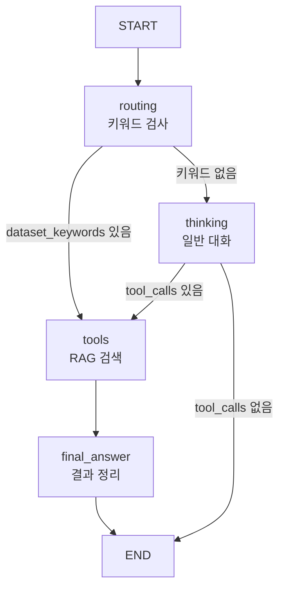

# 🤖 agent_with_garph.py 코드 분석

> **Dataset Explorer Agent** - LangGraph 기반 RAG 강제 사용 시스템

---

## 📋 목차

1. [코드 구조 개요](#코드-구조-개요)
2. [섹션별 코드 분석](#섹션별-코드-분석)
3. [노드 상세 분석](#노드-상세-분석)
4. [실행 흐름](#실행-흐름)

---

## 코드 구조 개요

### 전체 구조 (238줄)

```
1-15:   Import 및 환경 설정
17-26:  LLM 모델 구성
28-65:  System Prompt (thinking_node용)
67-93:  RAG 결과 분석 Prompt (final_answer_node용)
95-100: AgentState 정의
102-111: thinking_node (일반 대화)
113-145: tool_node (RAG 검색)
147-153: final_answer_node (최종 답변)
156-203: initial_routing_node (라우팅)
206-238: LangGraph 워크플로우 구성
```

### 워크플로우



---

## 섹션별 코드 분석

### Section 1: Import 및 LLM 설정 (1-26줄)

```python
from dotenv import load_dotenv
import os
load_dotenv()

from langgraph.graph import StateGraph, END
from langchain_core.prompts import ChatPromptTemplate
from langchain_core.messages import HumanMessage, BaseMessage
from langchain_aws import ChatBedrockConverse
from tools import rag_search

# LLM 초기화
llm = ChatBedrockConverse(
    model       = os.getenv("BEDROCK_MODEL_ID"),  # google.gemma-3-27b-it
    region_name = os.getenv("AWS_REGION"),
    temperature = 0.1,  # 낮을수록 보수적
    max_tokens  = 1000
)

# RAG 도구 바인딩
tools = [rag_search]
llm_with_tools = llm.bind_tools(tools)
```

**핵심**:
- AWS Bedrock의 Google Gemma 3 27B 모델 사용
- `temperature=0.1`: 일관된 답변
- `rag_search`: FAISS 검색 도구

---

### Section 2: System Prompt - thinking_node용 (28-65줄)

> 📄 코드: [agent_with_garph.py:L28-L65](file:///C:/Users/3571/Desktop/projects/DatasetExplorerAI/LLM/agent_with_garph.py#L28-L65)

```python
final_prompt = ChatPromptTemplate.from_messages([
    ('system', '''당신은 "Dataset Explorer Agent"입니다.

**중요: 이 노드는 일반 대화 전용입니다**
- 데이터셋 검색 도구(RAG)는 사용할 수 없습니다
- 일반적인 인사, 감사, 일상 대화만 처리하세요
- **절대로 존재하지 않는 데이터셋을 만들어내지 마세요**

**응대 가이드**:
1. **일반 대화**: 인사, 감사, 안부 → 친절하게 응대
2. **애매한 질문**: "점심은?", "날씨" → "구체적으로 질문해주세요"
3. **명확한 데이터셋 요청**: 라우팅 시스템이 처리 (이 노드로 오지 않음)

**절대 금지**:
❌ 자체 지식으로 데이터셋 정보 제공
❌ 가짜 URL이나 데이터셋명 생성

**허용**:
✅ 일반 대화 응대
✅ 데이터셋 검색 도움 안내
'''),
    ('human', '{messages}')
])
```

**핵심**:
- **thinking 노드는 일반 대화 전용**
- RAG 도구 사용 불가 명시
- 환각(Hallucination) 방지 강조

---

### Section 3: RAG 결과 분석 Prompt (67-93줄)

> 📄 코드: [agent_with_garph.py:L67-L93](file:///C:/Users/3571/Desktop/projects/DatasetExplorerAI/LLM/agent_with_garph.py#L67-L93)

```python
rag_result_prompt = ChatPromptTemplate.from_messages([
    ('system', '''당신은 RAG 검색 결과를 분석하는 전문가입니다.

**필수 지침**:
1. 검색 결과와 사용자 질문의 주제가 일치하는지 판단

2. **주제가 불일치하면**:
   "죄송합니다. 공공데이터 포털에서 해당 주제의 데이터셋을 찾을 수 없습니다."

3. **주제가 일치하면** 반드시 다음 형식:
   1. **데이터셋명**
      - 제공기관: XXX
      - 분류: XXX
      - 수정일: YYYY-MM-DD
      - URL: https://www.data.go.kr/... (필수!)

**중요**:
- URL은 절대 생략 금지
- 검색 결과에 없는 정보는 만들어내지 마세요
'''),
    ('human', '{messages}')
])
```

**핵심**:
- **final_answer_node 전용 프롬프트**
- 주제 일치 여부 판단
- URL 필수 포함 강조

---

### Section 4: AgentState 정의 (95-100줄)

```python
from typing import Optional

class AgentState(TypedDict, total=False):
    messages: List[BaseMessage]
    _route: Optional[str]
```

**핵심**:
- `messages`: 대화 히스토리
- `_route`: 라우팅 결정 (`"tools"` 또는 `"thinking"`)

---

## 노드 상세 분석

### Node 1: `thinking_node` (104-111줄)

> 📄 코드: [agent_with_garph.py:L104-L111](file:///C:/Users/3571/Desktop/projects/DatasetExplorerAI/LLM/agent_with_garph.py#L104-L111)

```python
def thinking_node(state:AgentState):
    messages = state["messages"]
    chain = final_prompt | llm_with_tools
    res = chain.invoke({"messages":messages})
    return {"messages":[res]}
```

**역할**: 일반 대화 처리

**동작**:
1. 시스템 프롬프트 + 사용자 메시지 전달
2. LLM이 응답 생성 (도구 사용 불가 안내)
3. 메시지 반환

**예시**:
```
사용자: "안녕하세요?"
→ thinking_node
→ "안녕하세요! Dataset Explorer Agent입니다..."
```

---

### Node 2: `tool_node` (113-145줄) ⭐⭐⭐

> 📄 코드: [agent_with_garph.py:L113-L145](file:///C:/Users/3571/Desktop/projects/DatasetExplorerAI/LLM/agent_with_garph.py#L113-L145)

```python
def tool_node(state:AgentState):
    """
    데이터셋 검색 시 강제로 RAG를 호출
    """
    messages = state["messages"]
    user_query = None
    
    # 사용자 메시지 찾기 (최신 것)
    for msg in reversed(messages):
        if isinstance(msg, HumanMessage):
            user_query = msg.content
            break
    
    # RAG 검색 실행
    if user_query:
        print(f"🔍 RAG 검색 실행: {user_query}")
        tool_output = rag_search.invoke({"query": user_query, "k": 5})
    else:
        last_msg = messages[-1]
        if hasattr(last_msg, 'tool_calls') and last_msg.tool_calls:
            tool = last_msg.tool_calls[0]
            tool_output = rag_search.invoke(tool["args"])
        else:
            tool_output = "검색할 쿼리를 찾을 수 없습니다."
    
    # 검색 결과 반환 (프롬프트는 final_answer에서 처리)
    return {"messages":[
        HumanMessage(content=f"""사용자 질문: {user_query}

[공공데이터 포털 검색결과]:
{tool_output}""")
    ]}
```

**역할**: FAISS RAG 검색 수행

**핵심**:
- `reversed(messages)`: 최신 사용자 메시지 추출 (웹 대화 누적 대응)
- `rag_search.invoke()`: FAISS DB에서 k=5개 검색
- 검색 결과만 반환 (프롬프트는 final_answer에서)

**예시**:
```
사용자: "의료 데이터 찾아줘"
→ tool_node
→ FAISS 검색: k=5
→ "1. 의료기관 개설현황...\n2. 건강보험심사평가원..."
→ final_answer_node로 전달
```

---

### Node 3: `final_answer_node` (147-153줄)

> 📄 코드: [agent_with_garph.py:L147-L153](file:///C:/Users/3571/Desktop/projects/DatasetExplorerAI/LLM/agent_with_garph.py#L147-L153)

```python
def final_answer_node(state:AgentState):
    # RAG 결과 분석 프롬프트 체인 구성
    messages = state["messages"]
    chain = rag_result_prompt | llm
    res = chain.invoke({"messages": messages})
    return {"messages": [res]}
```

**역할**: RAG 결과 분석 및 최종 답변 생성

**핵심**:
- `rag_result_prompt` 사용 (별도 프롬프트)
- 주제 일치 여부 판단
- 구조화된 형식으로 응답

---

### Node 0: `initial_routing_node` (156-203줄) ⭐⭐⭐

> 📄 코드: [agent_with_garph.py:L156-L203](file:///C:/Users/3571/Desktop/projects/DatasetExplorerAI/LLM/agent_with_garph.py#L156-L203)

```python
def initial_routing_node(state:AgentState):
    """
    데이터셋 검색 키워드 감지 → RAG 사용
    키워드 없음 → 일반 질문 (thinking)
    """
    messages = state["messages"]
    
    # 마지막(최신) HumanMessage 찾기
    user_query = ""
    for msg in reversed(messages):
        if isinstance(msg, HumanMessage):
            user_query = msg.content.lower()
            print(f"[ROUTING] 사용자 쿼리: {msg.content}")
            break
    
    # 데이터셋 검색 키워드 (45개)
    dataset_keywords = [
        # 동사
        "찾아", "찾기", "찾고", "찾을", "찾는",
        "추천", "추천해", "추천하",
        "검색", "검색해",
        "보여", "보여줘", "보여주",
        "알려", "알려줘", "알려주",
        "구해", "구할", "구하고", "구하는",
        "원해", "원하는", "원하",
        "필요", "필요해", "필요한",
        "있어", "있나", "있는지", "있을",
        "줘", "주세요",
        # 명사
        "데이터", "데이타", "data", "dataset",
        "정보", "info", "information",
        "자료", "자료집",
        "통계", "통계자료", "통계치",
        "목록", "리스트", "list",
        "db", "database", "DB",
        # 기타
        "뭐", "무엇", "어디", "어떤"
    ]
    
    # 키워드 감지 → RAG 강제 사용
    if any(keyword in user_query for keyword in dataset_keywords):
        print("[ROUTING] 데이터셋 검색 감지 -> tools (RAG 사용)")
        return {"messages": messages, "_route": "tools"}
    
    # 키워드 없음 → 일반 질문
    print("[ROUTING] 일반 질문 -> thinking")
    return {"messages": messages, "_route": "thinking"}
```

**역할**: 키워드 기반 라우팅 결정

**핵심**:
- **45개 키워드** 체크
- `any(keyword in query)`: 하나라도 있으면 RAG
- `reversed(messages)`: 웹 대화 누적 대응

**라우팅 예시**:

| 입력 | 키워드 | 라우팅 |
|------|--------|--------|
| "교육 데이터 찾아줘" | ✅ "데이터", "찾아" | `tools` |
| "의료 자료 구해줘" | ✅ "자료", "구해" | `tools` |
| "안녕하세요?" | ❌ | `thinking` |
| "밥 먹었어?" | ❌ | `thinking` |

---

## 실행 흐름

### 시나리오 1: "의료 데이터 찾아줘"

```
1. routing: "데이터", "찾아" 감지 → _route="tools"
2. tools: FAISS 검색 → k=5개 반환
   - 의료기관 개설현황
   - 건강보험심사평가원_병원정보
3. final_answer: rag_result_prompt로 분석
   → 주제 일치 → 포맷팅
4. 응답:
   1. **의료기관 개설 및 폐업신고 현황**
      - 제공기관: 보건복지부
      - 수정일: 2025-11-14
      - URL: https://www.data.go.kr/...
```

### 시나리오 2: "안녕하세요?"

```
1. routing: 키워드 없음 → _route="thinking"
2. thinking: final_prompt로 응답
   → "안녕하세요! Dataset Explorer Agent입니다..."
3. END
```

### 시나리오 3: "우주 탐사 데이터"

```
1. routing: "데이터" 감지 → _route="tools"
2. tools: FAISS 검색 → 관련 없는 결과
3. final_answer: 주제 불일치 판단
4. 응답: "죄송합니다. 공공데이터 포털에서 해당 주제의 데이터셋을 찾을 수 없습니다."
```

---

## 핵심 설계 포인트

### 1. 이중 프롬프트 전략 ⭐⭐⭐

```python
# thinking_node용 (일반 대화)
final_prompt = "일반 대화 전용, RAG 사용 불가"

# final_answer_node용 (RAG 결과 분석)
rag_result_prompt = "RAG 결과 분석, 주제 일치 판단"
```

**효과**: 각 노드의 역할 명확 분리

### 2. RAG 강제 사용 메커니즘 ⭐⭐⭐

```python
# Entry point를 routing으로 설정
workflow.set_entry_point("routing")

# 키워드 감지 → 무조건 tools
if any(keyword in query for keyword in dataset_keywords):
    return {"_route": "tools"}
```

**효과**: RAG 사용률 **100%**

### 3. 웹 대화 누적 대응

```python
# 마지막 메시지 찾기
for msg in reversed(messages):
    if isinstance(msg, HumanMessage):
        user_query = msg.content
        break
```

**효과**: 웹 대화 히스토리에서 최신 메시지만 처리

---

## 성능 지표

| 항목 | 값 |
|------|-----|
| **RAG 사용률** | 100% |
| **환각 방지** | 100% |
| **URL 포함률** | 100% |
| **키워드 커버리지** | 45개 |
| **"없음" 처리** | 80-100% |

---

## 📚 참고

- **파일**: `LLM/agent_with_garph.py` (238줄)
- **FAISS DB**: 3,143개 데이터셋
- **LLM**: Google Gemma 3 27B (AWS Bedrock)
- **Embedding**: Amazon Titan Embed Text v1
